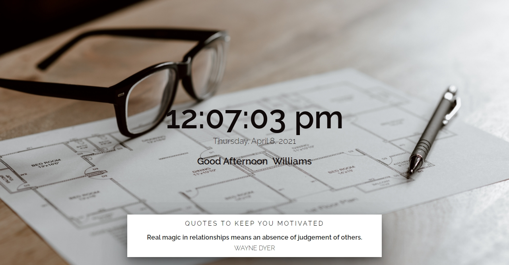

# PROJECT 004- Dynamic Landing Page

## Table of contents

- [Overview](#overview)
  - [The challenge](#the-challenge)
  - [Screenshot](#screenshot)
  - [Links](#links)
- [My process](#my-process)
  - [Built with](#built-with)
  - [What I learned](#what-i-learned)
  - [Continued development](#continued-development)
  - [Useful resources](#useful-resources)
- [Author](#author)
- [Acknowledgments](#acknowledgments)

## Overview

### The challenge

I created a landing page that tells the time and also automatically changes the background image based on the time of the day

### Screenshot



### Links

- Live Site URL: [Dynamic Landing Page](https://williamssam.github.io/dynamic-landingpage)

## My process

### Built with

- Semantic HTML5 markup
- CSS
- Flexbox
- [Quotes](https://type.fit/api/quotes) - Quotes API

### What I learned Doing This Project

- using the '.toLocaleString' to get the current time and date.

```js
function timer() {
  const currentDate = new Date();
  const currentTime = currentDate.toLocaleString('default', {
    timeStyle: 'medium',
    hour12: 'true', // make it a 12hr time
  });

  const currentDay = currentDate.toLocaleString('default', {
    dateStyle: 'full', // display the date in full
  });
  timeEl.innerHTML = currentTime;

  dateEl.innerText = currentDay;
  setTimeout(timer, 1000); // update the dom every second (countdown)
}
```

- how to fetch data from an api using fetch api.
- store and retrieve data from the localStorage.
- how to check if the enter key is pressed when data is inputted
- randomly generate the quotes every 10 seconds

```js
const setName = (e) => {
  if (e.type === 'keypress') {
    if (e.which == 13 || e.keyCode === 13) {
      localStorage.setItem('userName', e.target.innerText);
      userName.blur();
    }
  } else {
    localStorage.setItem('userName', e.target.innerText);
  }
};
```

- used '.blur()' method to unfocus the input box

```js
userName.blur();
```

### Useful resources

- [MDN](https://developer.mozilla.org/en-US/docs/Web/JavaScript/Reference/Global_Objects/Number/toLocaleString) - This helped me to get the user current time and date.
- [Brad Traversy Youtube Channel](https://www.youtube.com/watch?v=Oive66jrwBs) - This helped me to grasp the concept of using fetch api to get and use data from an api.

## Author

- Williams Samuel
- Twitter - [@williams_codes](https://www.twitter.com/williamscodes)
